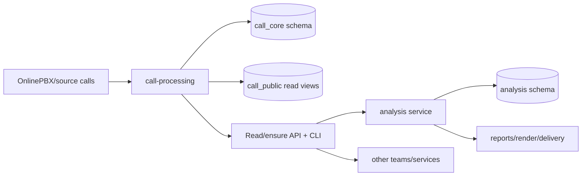

# Implementation Task Pack: Call Processing / Analysis Service Split

**Дата:** 2026-06-08  
**Проект:** `gmixam/ai-sales-analyzer`  
**Локальный planning source:** `C:\Users\Dogovor24\OneDrive\Проекты\Договор24\AI-SALES-ANALYZER`  
**Цель:** раздать реализацию агентам так, чтобы одним полным релизом разделить текущий сервис на `call-processing` и `analysis`, сохранив боевую готовность пилота и существующих отчетов.

---

## 1. Статус перед стартом реализации

Архитектурный baseline утвержден. Открытых бизнес-решений перед кодингом нет.

Источник решений:

- `artifacts/01-05/full_call_processing_service_split_tz.md`
- `artifacts/01-05/service_split_open_questions_audit.md`
- `DECISIONS.md`, ADR-040

Ключевые утвержденные решения:

- Физически используется одна PostgreSQL БД.
- Логическое разделение через schemas: `call_core`, `call_public`, `analysis`, `org`.
- Схема `analysis` используется вместо ранее обсуждавшейся `edo_analysis`.
- `call-processing` владеет OnlinePBX/source ingestion, audio, STT, transcript artifacts, LLM-1, retry/reconciliation, read API/views.
- `analysis` владеет LLM-2, отчетами, rendering, delivery, analysis-owned persistence.
- Внешние команды и сервис анализа являются клиентами `call-processing`.
- Доступ выдается по конкретному сервису или сотруднику, не по департаментам.
- Роли доступа: `admin` и `reader`.
- Только `admin` может запускать `ensure`, `dry_run`, `force_retry_failed`.
- UI не делается; все операционные действия через CLI.
- RAG/vector не входит в acceptance релиза, но контракт должен оставлять расширяемость.
- Retention/PII ограничения в этом релизе не вводятся: данные и artifacts хранятся бессрочно.
- Cutover может иметь короткое окно остановки.
- Feature flag: `CALL_PROCESSING_MODE=legacy|external_service`.
- Stale processing job: нет heartbeat/progress 30 минут.
- Retry: STT и LLM-1 = initial attempt + 2 retry.
- Auto retry только для `provider_timeout`, `rate_limited`, `provider_5xx`.
- Нет auto retry для `quota_insufficient`, `auth_error`, `source_audio_expired`, `source_audio_missing`.
- Late artifact rule: downstream scope помечается `source_artifacts_updated_after_analysis`; rerun analysis решает и запускает admin вручную.

---

## 2. Правила для агентов

1. Реализация ведется в Git repo `gmixam/ai-sales-analyzer`, не в локальной OneDrive planning-папке.
2. Локальная папка используется только для planning artifacts и handoff-документов.
3. Не пушить напрямую в `main`.
4. Работать в ветке `feat/call-processing-analysis-split` или в согласованной stacked-ветке от нее.
5. Каждая задача должна оставлять repo в проходящем состоянии: lint/typecheck/tests для затронутой зоны.
6. Нельзя менять `.env`, credentials, production secrets или выполнять destructive DB/FS операции без явного разрешения.
7. Нельзя добавлять UI.
8. Нельзя внедрять vector DB/RAG как обязательную часть релиза.
9. Нельзя ломать текущие сценарии pilot reporting: `manager_daily`, `rop_weekly`, manual reporting delivery.
10. Любое изменение контрактов должно обновлять тесты и документацию в repo.
11. После завершения задач по пакету нужно синхронизировать local planning docs: `AGENT_LOG.md`, а при изменении baseline - `DECISIONS.md` и соответствующие artifacts.

---

## 3. Целевая граница сервисов



`call-processing` обязан уметь:

- обнаруживать звонки;
- добирать пропущенные звонки;
- скачивать/обновлять audio source;
- выполнять STT;
- сохранять transcript artifacts;
- выполнять LLM-1;
- сохранять LLM-1 artifacts;
- повторять transient failures по утвержденной retry policy;
- отдавать read-only данные клиентам через API/views;
- поддерживать `ensure` для добора нужного scope.

`analysis` обязан уметь:

- получать готовые artifacts из `call-processing`;
- при необходимости вызвать `ensure`;
- анализировать только имеющиеся готовые или partial artifacts по текущим правилам анализа;
- формировать отчеты на том, что есть;
- видеть неполноту artifacts;
- помечать downstream scope при late artifacts;
- вручную, через admin CLI, запускать rerun analysis.

---

## 4. Merge Order

| Порядок | Task | Блокирует | Можно параллелить |
|---:|---|---|---|
| 0 | Repo baseline, branch, contract skeleton | все | нет |
| 1 | DB schemas, models, migrations, compatibility views | 2, 3, 5 | частично с 0 после contract freeze |
| 2 | `call-processing` domain service + artifact persistence | 3, 4, 5 | после 1 |
| 3 | `call-processing` API/CLI/auth/read grants | 5, 8 | после 1-2 |
| 4 | Extract LLM-1 from current analyzer path | 5, 6 | после 2 |
| 5 | `CallProcessingClient` + analysis refactor | 6, 8 | после 3-4 |
| 6 | Reporting/orchestrator refactor | 8 | после 5 |
| 7 | Runtime split: Docker/Celery/env/secrets | 8, 9 | после 2-5 |
| 8 | Test matrix + smoke scripts | 9 | starts early, finishes after 6-7 |
| 9 | Cutover/rollback/runbook/docs | release | after 6-8 |

Acceptance is evaluated only on the complete release, not on partial task completion.

---

## 5. Exact Contracts

### 5.1 DB ownership

Target schemas:

- `call_core`: owned only by `call-processing`.
- `call_public`: read-only surface for clients.
- `analysis`: owned only by `analysis`.
- `org`: shared reference data if already present or needed.

Required migration outcome:

- Existing call/source/STT-related tables are moved or mapped into `call_core`.
- Existing analysis/reporting tables are moved or mapped into `analysis`.
- Backward compatibility is preserved through views or repository-layer compatibility during cutover.
- No global destructive migration without backup and rollback script.

Required `call_core` concepts:

- interactions/calls with stable source identifiers;
- source audio metadata;
- processing runs;
- artifacts;
- artifact versions;
- heartbeat/progress timestamps;
- error class/status;
- source/update timestamps used to detect late artifacts.

Required `call_public` read views:

- `processed_calls_v1`
- `transcripts_v1`
- `llm1_artifacts_v1`
- `processing_runs_v1`

The view names are contract names. Internal table names may follow repo conventions.

### 5.2 Artifact contract

Artifact kinds:

- `transcript`
- `transcript_segments`
- `llm1_first_pass`

Artifact status:

- `ready`
- `missing`
- `processing`
- `failed`
- `skipped`
- `stale`

Processing run status:

- `queued`
- `running`
- `ready`
- `partial`
- `blocked`
- `failed`

Error classes:

- `quota_insufficient`
- `rate_limited`
- `auth_error`
- `provider_timeout`
- `provider_5xx`
- `source_audio_expired`
- `source_audio_missing`
- `source_recording_url_refresh_failed`
- `validation_error`
- `unknown_error`

Retryable error classes:

- `provider_timeout`
- `rate_limited`
- `provider_5xx`

Non-retryable error classes:

- `quota_insufficient`
- `auth_error`
- `source_audio_expired`
- `source_audio_missing`
- `source_recording_url_refresh_failed`
- `validation_error`

### 5.3 LLM-1 artifact contract

Contract name: `llm1_first_pass_v1`

Required payload fields:

```json
{
  "schema_version": "llm1_first_pass_v1",
  "prompt_version": "string",
  "provider": "string",
  "model": "string",
  "account_alias": "string|null",
  "created_at": "datetime",
  "status": "ready|failed|skipped",
  "classification": {},
  "summary": {},
  "follow_up": {},
  "data_quality": {},
  "analysis_focus": {},
  "error": {
    "class": "string|null",
    "message": "string|null",
    "retryable": "boolean"
  }
}
```

Rules:

- `analysis` must not call LLM-1 provider directly in external service mode.
- LLM-1 result must be persisted before LLM-2 analysis starts.
- LLM-2 must consume LLM-1 by contract, not by current in-memory analyzer internals.
- Payload must allow future embedding/vector metadata without requiring vector DB now.

### 5.4 Access/auth contract

Access is configured per client:

```json
{
  "client_id": "string",
  "client_type": "service|employee",
  "role": "admin|reader",
  "allowed_artifact_kinds": ["transcript", "transcript_segments", "llm1_first_pass"],
  "read_surfaces": ["processed_calls_v1", "transcripts_v1", "llm1_artifacts_v1", "processing_runs_v1"],
  "rate_limits": {
    "ensure_per_hour": 0,
    "read_per_minute": 0
  },
  "created_by_admin": "string",
  "active": true
}
```

Rules:

- `reader` can only read.
- `admin` can read and run `ensure`, `dry_run`, `force_retry_failed`.
- No department-level grant.
- No client writes directly into `call_core`.
- Direct DB access for external teams is read-only and only through `call_public` grants.

### 5.5 API contract

Minimum required endpoints:

```text
POST /call-processing/ensure
GET  /call-processing/runs/{run_id}
GET  /call-processing/artifacts
GET  /call-processing/health
```

`POST /call-processing/ensure` request:

```json
{
  "scope": {
    "department": "string|null",
    "manager_ids": ["string"],
    "date_from": "date",
    "date_to": "date",
    "source": "onlinepbx"
  },
  "required_artifacts": ["transcript", "transcript_segments", "llm1_first_pass"],
  "mode": "ensure|dry_run",
  "force_retry_failed": false,
  "requested_by": "client_id"
}
```

Response:

```json
{
  "run_id": "string",
  "status": "queued|running|ready|partial|blocked|failed",
  "scope_hash": "string",
  "planned": {
    "calls_total": 0,
    "already_ready": 0,
    "to_ingest": 0,
    "to_transcribe": 0,
    "to_llm1": 0,
    "blocked": 0
  },
  "quota": {
    "status": "ok|insufficient|unknown",
    "reason": "string|null"
  }
}
```

Rules:

- `dry_run` must not start provider calls.
- If quota is exhausted, processing pauses and admin is notified by CLI-visible status/log; no further paid work starts.
- `ensure` must be idempotent for the same scope and artifact requirements.
- Repeated `ensure` must not duplicate source calls or artifacts.

### 5.6 CLI contract

Required admin commands:

```text
call-processing ensure --scope <json-or-file> --required-artifacts transcript,transcript_segments,llm1_first_pass
call-processing dry-run --scope <json-or-file> --required-artifacts transcript,transcript_segments,llm1_first_pass
call-processing retry-failed --run-id <run_id>
call-processing run-status --run-id <run_id>
call-processing artifacts --scope <json-or-file>
```

Required analysis commands or options:

```text
analysis run-manager-daily --scope <json-or-file> --call-processing-mode legacy|external_service
analysis rerun --analysis-scope-id <id> --reason late_artifacts
analysis source-status --analysis-scope-id <id>
```

Exact command module names may follow repo style, but the capability names above are mandatory.

### 5.7 Env/runtime contract

Required env split:

```text
APP_SERVICE=call_processing|analysis|monolith_legacy
CALL_PROCESSING_MODE=legacy|external_service
CALL_PROCESSING_BASE_URL=<url>
CALL_PROCESSING_CLIENT_ID=<id>
CALL_PROCESSING_CLIENT_SECRET=<secret>
CALL_PROCESSING_QUEUE=call_processing
ANALYSIS_QUEUE=analysis
```

Rules:

- `call-processing` container/worker owns OnlinePBX/STT/LLM-1 secrets.
- `analysis` container/worker owns LLM-2/report/delivery secrets.
- Legacy mode remains available for rollback during pilot.
- External service mode must remove direct STT/LLM-1 execution from `analysis`.

---

## 6. Task Cards

### Task 0. Repo Baseline and Contract Skeleton

**Owner:** Release/coordination agent  
**Goal:** prepare implementation branch and add contract placeholders before parallel coding starts.

Inputs:

- This task pack.
- Full split TЗ.
- ADR-040.
- Current `main` of `gmixam/ai-sales-analyzer`.

Likely touched:

- repo documentation;
- contract modules or schemas;
- test fixtures;
- PR description/handoff file.

Required output:

- branch `feat/call-processing-analysis-split`;
- draft PR opened or local branch ready for PR;
- initial contract module with enums/data shapes;
- implementation checklist copied into repo docs.

DoD:

- Current tests pass before changes or failures are documented as pre-existing.
- Contract constants/enums are available for later tasks.
- No behavior change yet.

Tests:

- baseline test command documented;
- import test for new contract module.

Must not do:

- no migrations;
- no runtime behavior change;
- no secret/env edits.

---

### Task 1. DB Schemas, Models, Migrations, Compatibility

**Owner:** DB/migrations agent  
**Goal:** create durable persistence boundary for `call-processing` and `analysis`.

Dependencies:

- Task 0.

Likely touched:

- DB models;
- migrations;
- repositories;
- DB init scripts;
- tests for models/repositories.

Required output:

- schemas `call_core`, `call_public`, `analysis`, `org` created or mapped;
- artifact persistence model;
- processing run model;
- read-only public views;
- migration/backfill path from current tables;
- rollback migration or documented rollback command.

DoD:

- Existing data shape can be migrated without losing current pilot data.
- Existing reports still read through compatibility layer or updated repositories.
- `call_public` grants can be read-only.
- `analysis` no longer needs write access to `call_core`.

Tests:

- migration up/down test on empty DB;
- migration on representative seeded current DB;
- unique/idempotency test for source call identifiers;
- artifact versioning test;
- public view read test;
- direct write denial test if DB grant tests are available.

Must not do:

- no provider calls;
- no analyzer behavior refactor in this task;
- no destructive migration without rollback.

Handoff:

- provide table/view names;
- provide ORM/repository names;
- document any compatibility shims.

---

### Task 2. Call Processing Domain Service

**Owner:** call-processing backend agent  
**Goal:** move source discovery, ingest, audio, STT, LLM-1 orchestration into a service boundary.

Dependencies:

- Task 1.

Likely touched:

- current OnlinePBX intake/extractor modules;
- new `call_processing` package/module;
- artifact repositories;
- retry/reconciliation code;
- provider wrappers.

Required output:

- `CallProcessingService.ensure(scope, required_artifacts, mode)` or equivalent;
- idempotent source discovery;
- STT artifact persistence;
- transcript segments artifact persistence;
- LLM-1 artifact persistence;
- processing run heartbeat/progress;
- retry policy implementation.

DoD:

- Same call scope can be ensured multiple times without duplicates.
- Missing calls are discovered and added.
- Missing artifacts are processed.
- Already ready artifacts are reused.
- Stale jobs are detected after 30 minutes without heartbeat/progress.
- Quota exhaustion pauses processing and exposes blocked status.

Tests:

- ensure idempotency;
- missing call ingestion;
- missing transcript processing;
- LLM-1 artifact creation;
- partial result status;
- retryable errors get initial + 2 retries;
- non-retryable errors do not retry;
- quota exhaustion blocks further paid work.

Must not do:

- no LLM-2 analysis;
- no report rendering/delivery;
- no UI.

Handoff:

- expose service methods for API/CLI agent;
- expose artifact read repository for analysis client.

---

### Task 3. Call Processing API, CLI, Auth, Read Grants

**Owner:** service API/security agent  
**Goal:** expose `call-processing` as a consumable service for analysis and other teams.

Dependencies:

- Task 1.
- Task 2 can be stubbed initially, must integrate before completion.

Likely touched:

- API routes/controllers;
- auth middleware;
- CLI entrypoints;
- settings/config;
- access grant model.

Required output:

- `POST /call-processing/ensure`;
- `GET /call-processing/runs/{run_id}`;
- `GET /call-processing/artifacts`;
- `GET /call-processing/health`;
- CLI commands from contract;
- per-client grants with `admin|reader`;
- read-only DB grant pattern for `call_public`.

DoD:

- `reader` cannot run `ensure`, `dry_run`, `retry-failed`.
- `admin` can run admin operations.
- `dry_run` returns planned work and quota status without provider calls.
- API and CLI return enough status to see missing/partial artifacts.
- Auth does not depend on department grants.

Tests:

- auth role matrix;
- dry run no side effects;
- admin ensure allowed;
- reader ensure denied;
- artifact filtering by allowed kinds;
- health endpoint smoke.

Must not do:

- no broad admin-by-default access;
- no department-level permissions;
- no direct write access for external teams.

Handoff:

- publish client examples;
- provide base URL/config names to analysis integration agent.

---

### Task 4. Extract LLM-1 from Analyzer Runtime

**Owner:** analyzer/refactor agent  
**Goal:** remove in-memory LLM-1 ownership from the current analysis path and persist LLM-1 as a `call-processing` artifact.

Dependencies:

- Task 2.

Likely touched:

- current analyzer module;
- LLM-1 prompt/provider wrapper;
- artifact serialization;
- tests around LLM-1/LLM-2 input.

Required output:

- LLM-1 invocation belongs to `call-processing`.
- LLM-1 output uses `llm1_first_pass_v1`.
- LLM-2 input reads persisted LLM-1 artifact in external mode.
- Legacy mode remains available behind `CALL_PROCESSING_MODE=legacy`.

DoD:

- No direct LLM-1 provider call from `analysis` in external mode.
- Legacy mode keeps existing behavior for rollback.
- LLM-1 payload validation fails loudly before LLM-2 if contract is invalid.
- LLM-1 prompt version/provider/model/account alias are stored.

Tests:

- legacy mode still passes current analyzer tests;
- external mode consumes artifact;
- missing LLM-1 artifact produces partial/missing status, not crash;
- invalid artifact schema is rejected;
- provider metadata persisted.

Must not do:

- no change to LLM-2 business rules unless needed for contract read;
- no vector/RAG implementation.

Handoff:

- document exact mapper from old LLM-1 output to `llm1_first_pass_v1`.

---

### Task 5. CallProcessingClient and Analysis Refactor

**Owner:** analysis integration agent  
**Goal:** make `analysis` a client of `call-processing`.

Dependencies:

- Task 3.
- Task 4.

Likely touched:

- reporting orchestrator;
- analyzer services;
- new client module;
- settings;
- tests for daily/weekly/manual report flows.

Required output:

- `CallProcessingClient` abstraction;
- external service mode flow:
  1. analysis builds scope;
  2. analysis calls `ensure`;
  3. analysis reads ready/partial artifacts;
  4. analysis runs LLM-2/reporting on available artifacts;
  5. analysis records incomplete source status;
- late artifact detection marker.

DoD:

- `analysis` no longer imports OnlinePBX/STT/LLM-1 internals in external mode.
- Reports are generated on available data.
- Missing artifacts are visible in analysis metadata/report source status.
- Late artifacts mark affected downstream scope as `source_artifacts_updated_after_analysis`.
- Admin can manually rerun analysis for a marked scope.

Tests:

- ready artifacts path;
- partial artifacts path;
- ensure called for missing scope;
- no ensure call when all required artifacts are ready;
- late artifact marker;
- manual rerun clears or supersedes marker;
- current pilot `manager_daily` behavior preserved.

Must not do:

- no automatic rerun of analysis after late artifacts;
- no hidden provider calls from analysis in external mode.

Handoff:

- publish integration contract and failure modes for reporting agent.

---

### Task 6. Reporting and Orchestrator Refactor

**Owner:** reporting/orchestration agent  
**Goal:** adapt manager daily, ROP weekly and manual pilot orchestration to the new boundary without breaking pilot reporting.

Dependencies:

- Task 5.

Likely touched:

- reporting orchestrator;
- manual pilot orchestrator;
- delivery pipeline;
- report builders;
- existing CLI/report commands.

Required output:

- existing reporting commands work in `legacy` and `external_service` mode;
- reports include source completeness metadata;
- report generation handles partial artifacts according to existing analysis rules;
- no direct upstream ownership remains in reporting layer in external mode.

DoD:

- `manager_daily/build_missing_and_report` works in both modes.
- `rop_weekly` works in both modes.
- Manual pilot report still renders and delivers.
- Missing STT/LLM-1 artifacts do not crash report generation.
- Existing rules for scheduled/reviewable calls remain unchanged.

Tests:

- manager daily smoke with full artifacts;
- manager daily smoke with partial artifacts;
- ROP weekly persisted report;
- delivery disabled/enabled smoke as existing patterns allow;
- regression tests for current status transitions.

Must not do:

- no redesign of report format unless required to show source completeness;
- no UI.

Handoff:

- provide smoke command list to QA/release agent.

---

### Task 7. Runtime Split: Docker, Celery, Env, Secrets

**Owner:** runtime/DevOps agent  
**Goal:** make both services deployable and operable separately while sharing PostgreSQL.

Dependencies:

- Task 2.
- Task 3.
- Task 5.

Likely touched:

- `docker-compose.yml`;
- worker/beat config;
- settings;
- deployment docs;
- env example files if repo has them.

Required output:

- separate app service modes;
- separate workers/queues for `call_processing` and `analysis`;
- env split so each service only requires its own secrets;
- legacy mode rollback configuration;
- healthchecks.

DoD:

- `call-processing` starts without LLM-2/report/delivery secrets.
- `analysis` starts without OnlinePBX/STT/LLM-1 secrets in external mode.
- Queue routing prevents analysis workers from executing call-processing jobs and vice versa.
- Legacy mode can be restored during rollback.
- Docker/local compose smoke passes.

Tests:

- config validation per `APP_SERVICE`;
- queue routing test;
- compose config validation;
- healthcheck smoke;
- missing-secret negative tests per service mode.

Must not do:

- no real production secret edits;
- no destructive DB reset.

Handoff:

- provide exact local startup commands and required env variables.

---

### Task 8. Test Matrix and Verification Pack

**Owner:** QA/release validation agent  
**Goal:** make release acceptance executable and reproducible.

Dependencies:

- starts after Task 0;
- final pass after Tasks 1-7.

Likely touched:

- unit/integration tests;
- smoke scripts;
- CI config if present;
- docs for test execution.

Required output:

- test plan committed into repo;
- smoke commands for local and CI-like run;
- seeded fixtures for full/partial/missing artifacts;
- verification report.

Minimum test matrix:

| Area | Required checks |
|---|---|
| DB | migrations up/down, views, grants, artifact versioning |
| Processing | ensure idempotency, retry policy, stale job, quota block |
| API/Auth | admin/reader matrix, dry-run no side effects, artifact filtering |
| LLM-1 | contract validation, metadata persistence, invalid payload rejection |
| Analysis | external mode no direct STT/LLM-1, partial data reports, late marker |
| Reporting | manager daily, ROP weekly, manual pilot delivery path |
| Runtime | service-specific env, queue routing, healthchecks |
| Rollback | switch to `legacy`, existing reports still run |

DoD:

- All new acceptance tests pass.
- Existing relevant tests pass or documented failures are fixed.
- Smoke commands are copy-paste runnable.
- Verification report identifies commit/branch tested.

Must not do:

- no fake green status if smoke was not run;
- no changing business rules to make tests easier.

---

### Task 9. Cutover, Rollback, Runbook, Handoff Docs

**Owner:** release/runbook agent  
**Goal:** prepare production-safe pilot transition.

Dependencies:

- Tasks 1-8.

Likely touched:

- repo README/runbook docs;
- migration notes;
- release checklist;
- local planning handoff docs after implementation.

Required output:

- cutover checklist with short pause window;
- rollback checklist;
- pre-cutover backup/export instructions;
- smoke verification checklist;
- admin CLI operations guide;
- service/client access setup guide;
- known failure/recovery guide.

Cutover minimum:

1. Announce short pause window.
2. Stop/reporting schedule if needed.
3. Backup DB.
4. Deploy migrations.
5. Start `call-processing`.
6. Run `dry-run` for pilot scope.
7. Run `ensure` for pilot scope.
8. Start `analysis` in `external_service`.
9. Run manager daily smoke.
10. Run ROP weekly smoke if applicable.
11. Resume schedule.

Rollback minimum:

1. Stop new `external_service` analysis runs.
2. Set `CALL_PROCESSING_MODE=legacy`.
3. Route workers back to legacy mode.
4. Verify manager daily report.
5. Keep migrated artifacts for audit; do not delete without explicit approval.

DoD:

- A new agent/operator can execute cutover from docs.
- Rollback does not require code changes.
- Known partial/missing artifact scenarios are documented.
- Admin notification behavior for quota exhaustion is documented.

Must not do:

- no unapproved production change;
- no data deletion.

---

## 7. Whole Release Definition of Done

The release is complete only when all items below are true:

- `call-processing` and `analysis` can run as separate services/workers.
- Shared PostgreSQL is logically separated by schemas and ownership.
- `call-processing` persists transcripts, transcript segments and LLM-1 artifacts.
- `analysis` consumes artifacts via client/API/read views in external mode.
- `analysis` does not call STT/LLM-1 providers in external mode.
- Current pilot reporting flows still work.
- Reports can be generated on partial data.
- Missing/incomplete source artifacts are visible.
- Late artifacts mark affected downstream analysis scope.
- Admin can manually rerun analysis after late artifacts.
- Admin-only `ensure`, `dry_run`, `force_retry_failed` are enforced.
- Reader clients can only read allowed artifacts/surfaces.
- Retry policy matches approved defaults.
- Quota exhaustion pauses processing and notifies/exposes admin action.
- Docker/runtime config supports separate services and legacy rollback.
- Full test matrix passes.
- Cutover and rollback runbooks exist and were smoke-validated.

---

## 8. Agent Handoff Template

Use this template when assigning any task card:

```text
You are implementing Task <N> from:
C:\Users\Dogovor24\OneDrive\Проекты\Договор24\AI-SALES-ANALYZER\artifacts\01-05\implementation_task_pack_for_agents.md

Repo:
https://github.com/gmixam/ai-sales-analyzer

Branch:
feat/call-processing-analysis-split

Source-of-truth docs:
- artifacts/01-05/full_call_processing_service_split_tz.md
- artifacts/01-05/service_split_open_questions_audit.md
- DECISIONS.md ADR-040

Scope:
Implement only Task <N>. Preserve current pilot behavior. Do not add UI. Do not add vector/RAG as required runtime. Do not edit secrets. Do not push directly to main.

Required final output:
- files changed
- tests run and results
- contract changes
- docs updated
- blockers or residual risks
- handoff notes for dependent tasks
```

---

## 9. Recommended Agent Assignment

| Agent | Tasks | Primary risk |
|---|---|---|
| Agent A: Release coordinator | 0, merge discipline, PR state | agents diverge on contracts |
| Agent B: DB/backend | 1 | data migration and compatibility |
| Agent C: Call-processing | 2, part of 3 | idempotency, retry, artifact persistence |
| Agent D: API/security | 3 | overbroad access, admin/reader enforcement |
| Agent E: Analyzer | 4, 5 | hidden STT/LLM-1 calls remain in analysis |
| Agent F: Reporting | 6 | pilot regressions |
| Agent G: Runtime | 7 | env/queue coupling |
| Agent H: QA/release | 8, 9 | incomplete smoke coverage |

If there are fewer agents, combine tasks in this order:

1. A + H
2. B + C
3. D + G
4. E + F

---

## 10. Known Repo Seams to Inspect First

From prior audit of current `main`:

- `core/app/agents/calls/reporting.py`
  - `CallsManualReportingOrchestrator`
  - `manager_daily/build_missing_and_report`
  - currently orchestrates source discovery, ingest, audio, STT, LLM-1, LLM-2, persistence, report/delivery.
- `core/app/agents/calls/analyzer.py`
  - `CallsAnalyzer.analyze_call()`
  - currently calls `_request_llm1_first_pass()` before LLM-2.
- `core/app/agents/calls/extractor.py`
  - STT writes transcript into `interaction.text`;
  - segments/routing metadata into `interaction.metadata`.
- `core/app/core_shared/db/models.py`
  - `Interaction` currently has global `external_id` uniqueness, `text`, `metadata`, status;
  - `Analysis` stores LLM-2 normalized/raw;
  - no durable LLM-1 artifact table in prior audit.
- `docker-compose.yml`
  - prior audit found one `api`, one `worker`, one `beat`;
  - no separated service/queue/env split yet.
- `core/app/core_shared/config/settings.py`
  - prior audit found one settings object requiring OnlinePBX/STT/LLM/report/delivery secrets together.

Agents must verify current repo state before editing because the Git repo may have changed after this planning artifact.

---

## 11. Release Risk Register

| Risk | Mitigation |
|---|---|
| Analysis still triggers STT/LLM-1 in external mode | import boundary tests and provider-call mocks |
| Duplicate calls/artifacts after repeated ensure | scope hash, source unique keys, idempotency tests |
| Partial data silently looks complete | source completeness metadata and report/source status |
| Late artifacts never trigger rerun awareness | `source_artifacts_updated_after_analysis` marker |
| Other teams get too much access | per-client grants, reader-only DB views, auth tests |
| Quota exhaustion keeps spending | quota block status and provider-call stop tests |
| Cutover breaks pilot reporting | short pause window, dry run, legacy rollback flag |
| Shared DB becomes accidental shared write DB | schema ownership, grants, repository boundaries |

---

## 12. Final Implementation Prompt

When starting implementation, use:

```text
Implement the full call-processing / analysis split according to the approved task pack.

Primary artifact:
C:\Users\Dogovor24\OneDrive\Проекты\Договор24\AI-SALES-ANALYZER\artifacts\01-05\implementation_task_pack_for_agents.md

Do not stop at partial design. Work in the Git repo, create the implementation branch, execute the task cards in merge order, keep pilot reporting working, and finish with tests, runbook, rollback docs and a clear PR/handoff summary.
```
